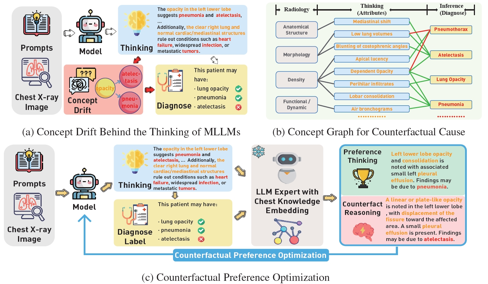
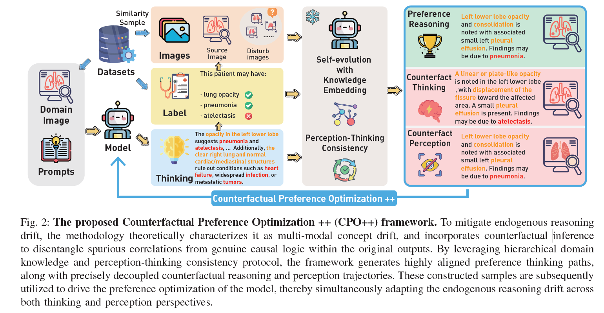

<div align="center">

# CPO & CPO++

### Counterfactual Preference Optimization for Robust Multimodal Reasoning


[](https://xiaoyuyoung.github.io/CPO/)
[](https://arxiv.org/abs/2505.13081)
[](https://openreview.net/forum?id=1BAiQmAFsx)

[](https://arxiv.org/abs/2604.15705)
[](https://huggingface.co/datasets/MiaoMiaoYang/CXR-CounterFact)


</div>

## News

- **CPO** has been accepted at **NeurIPS 2025**.
- The CPO training code and the **CXR-CounterFact** dataset are publicly available.
- The **CPO++** paper is available on [arXiv](https://arxiv.org/abs/2604.15705), and its implementation is publicly released in this repository.

## Overview

This repository provides the official implementation and resources for **Counterfactual Preference Optimization (CPO)** and its extended framework, **Counterfactual Preference Optimization++ (CPO++)**.


**CPO** studies detrimental concept drift in chain-of-thought reasoning during non-stationary reinforcement fine-tuning. It constructs radiologically plausible counterfactual reasoning trajectories with domain concept graphs and uses preference optimization to disentangle beneficial domain adaptation from harmful reasoning drift.


**CPO++** extends counterfactual drift disentanglement from the thinking stream to joint perception–thinking alignment. It targets endogenous multimodal reasoning drift under non-stationary multi-stream supervision by incorporating hierarchical domain knowledge, autonomous counterfactual perception and thinking trajectories, perception–thinking consistency constraints, and policy-adaptive preference optimization.

In short, **CPO stabilizes how a model reasons, while CPO++ closes the perception–reasoning loop by jointly stabilizing what the model perceives and how it reasons.**

## CPO and CPO++ at a Glance

| Framework | Alignment scope | Main challenge | Key components | Evaluation domains |
|---|---|---|---|---|
| **CPO** | Thinking/reasoning stream | Detrimental CoT drift during non-stationary fine-tuning | Domain concept graph, counterfactual CoTs, counterfactual preference optimization | Medical diagnosis |
| **CPO++** | Perception and thinking streams | Endogenous multimodal reasoning drift under multi-stream supervision | Hierarchical domain knowledge, counterfactual perception and thinking, perception–thinking consistency, policy-adaptive alignment | Medical diagnosis and autonomous driving |

## Papers

### CPO

**Walking the Tightrope: Autonomous Disentangling Beneficial and Detrimental Drifts in Non-Stationary Custom-Tuning**  
Xiaoyu Yang, Jie Lu, and En Yu  
*The Thirty-Ninth Annual Conference on Neural Information Processing Systems (NeurIPS 2025)*

[[Project Page](https://xiaoyuyoung.github.io/CPO/)]
[[arXiv](https://arxiv.org/abs/2505.13081)]
[[OpenReview](https://openreview.net/forum?id=1BAiQmAFsx)]
[[Dataset](https://huggingface.co/datasets/MiaoMiaoYang/CXR-CounterFact)]

### CPO++

**Towards Robust Endogenous Reasoning: Unifying Drift Adaptation in Non-Stationary Tuning**  
Xiaoyu Yang, En Yu, Wei Duan, and Jie Lu  
*arXiv preprint, 2026*

[[arXiv](https://arxiv.org/abs/2604.15705)]
[[PDF](https://arxiv.org/pdf/2604.15705)]

## Method

### CPO: Counterfactual Reasoning Alignment



CPO contains three main stages:

1. **Concept-drift formulation.** Autoregressive CoT generation is modeled as a stream of next-token prediction actions, exposing unpredictable distributional changes during non-stationary fine-tuning.
2. **Counterfactual trajectory construction.** A radiological concept graph guides controlled attribute perturbations to generate clinically plausible counterfactual CoTs.
3. **Counterfactual preference optimization.** Preference alignment separates beneficial domain adaptation from spurious reasoning drift, improving robustness and generalization.

### CPO++: Perception–Thinking Consistent Alignment




CPO++ advances CPO through four extensions:

1. **Hierarchical domain knowledge** for structured multimodal counterfactual construction.
2. **Autonomous counterfactual perception and thinking trajectories** that cover both visual interpretation and downstream reasoning.
3. **Perception–thinking consistency constraints** that identify and suppress mismatches across the multimodal reasoning process.
4. **Policy-adaptive preference optimization** that aligns informative counterfactual constraints with the evolving model policy.


## Training

The current implementation is built with [Qwen2.5-VL](https://github.com/QwenLM/Qwen2.5-VL), and its supervised and preference fine-tuning pipelines are supported by [ms-swift](https://github.com/modelscope/ms-swift).


To supervised-fine the Qwen2.5-VL with multi-node distributed training, run the following with 2 GPUs:

```bash
nohup bash SFT-Qwen2.5.sh > sft.log 2>&1 &
```
To reinforced fine-tune with CPO the Qwen2.5-VL with multi-node distributed training, run the following:

```bash
nohup bash CPO/CPO-Qwen2.5.sh > cpo.log 2>&1 &
```

To reinforced fine-tune with CPO++ the Qwen2.5-VL with multi-node distributed training, run the following:

```bash
nohup bash CPO++/CPO-plus-Qwen2.5.sh > cpo++.log 2>&1 &
```


## CXR-CounterFact (CCF) Dataset


Since we are pioneers in introducing counterfactual cause into reinforced custom-tuning of MLLMs, we are deeply aware of the scarcity of counterfactual CoT in downstream tasks, especially in the highly professional medical field. Thus, our aspiration is for the model to adeptly acclimate to the concept drift by itself, acquiring abundant knowledge with more and more data, but not exhibiting bias.

In this context, a more realistic training dataset for multi-modal large language models is required to validate their potential to be trained under the non-stationary reinforced custom-tuning. Recognizing the demand for higher-quality multi-modal data with CoT, we develop a datasets called CXR-CounterFact Dataset (CCF), extending the [MIMIC-CXR](https://physionet.org/content/mimic-cxr/2.1.0/) with counterfactual chain-of-thought. This novel dataset introduces 320,416 meticulously curated counterfactual pairs spanning 14 thoracic pathologies, establishing a pioneering large-scale benchmark for causal interpretation in clinical chest X-ray analysis.


We have upload this dataset on [huggingface](https://huggingface.co/datasets/MiaoMiaoYang/CXR-CounterFact), you can download using this command:

```bash
git clone https://huggingface.co/datasets/MiaoMiaoYang/CXR-CounterFact
```


## Release Roadmap

- [x] CPO paper
- [x] CPO training code
- [x] CXR-CounterFact dataset
- [x] CPO++ paper ([arXiv:2604.15705](https://arxiv.org/abs/2604.15705))
- [x] CPO++ code
- [ ] CPO++ model checkpoints

## Citation

If you find CPO useful for your research, please cite:

```bibtex
@inproceedings{yang2025walking,
  title     = {Walking the Tightrope: Autonomous Disentangling Beneficial and Detrimental Drifts in Non-Stationary Custom-Tuning},
  author    = {Yang, Xiaoyu and Lu, Jie and Yu, En},
  booktitle = {The Thirty-Ninth Annual Conference on Neural Information Processing Systems},
  year      = {2025},
  url       = {https://openreview.net/forum?id=1BAiQmAFsx}
}

@article{yang2026towards,
  title   = {Towards Robust Endogenous Reasoning: Unifying Drift Adaptation in Non-Stationary Tuning},
  author  = {Yang, Xiaoyu and Yu, En and Duan, Wei and Lu, Jie},
  journal = {arXiv preprint arXiv:2604.15705},
  year    = {2026},
  url     = {https://arxiv.org/abs/2604.15705}
}
```

## Acknowledgements

This repository builds upon [Qwen2.5-VL](https://github.com/QwenLM/Qwen2.5-VL) and [ms-swift](https://github.com/modelscope/ms-swift). We thank their contributors for making these resources publicly available.
